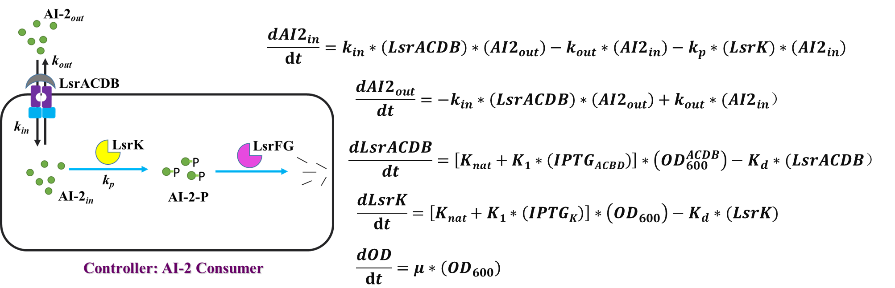

```{r setup, include=FALSE}
library(bisecpp)
library(ggplot2)

knitr::opts_chunk$set(echo = TRUE, cache = TRUE, collapse = TRUE, fig.path = 'images/');
```

General-purpose Optimization using enhanced bisection method


I developed general-purpose optimization algorithm using enhanced bisection method. The key problem is that when you want to fit a complex model defined by tangled differential equation which can only be solved numerically, existing methods usually takes very long time (you may even run out of memory with some software like Mathematica®). I implement a novel program which can give a pretty good solution in reasonable time.

to do: incorporate `iGEM/model/R`

how can you fit this equation?



```{r}
ideal.para <- c(k.in = 0.008, k.out = 0.045, k.p = 0.006);
extra <- c(IPTG.ACDB = TRUE, IPTG.K = TRUE, AI2.out.0 = 1);
data <- simulate_data(f_AI2_out, ideal.para, extra, seq(0,270,10));
space <- cbind(integer(length(ideal.para)), ideal.para * 3);

fit <- bisec_fit(data, f_AI2_out, extra, space, 4, 10, 1/3, 1)
assess(fit[[2]], ideal.para)

fit.RSquare <- fit[[1]];
fit.para <- fit[[2]];
fit.fun <- f_AI2_out(fit.para, extra)


ggplot() + 
	geom_point(aes(x, y), data.frame(data)) + 
	geom_line(aes(x,y), data.frame(x = 1:270, y = fit.fun(1:270)))
	


```


```{r, eval=FALSE}
# data2 <- simulate_data(f_AI2_out, ideal.para2, extra21, seq(0,270,30));
# range2 <- cbind(integer(length(ideal.para2)), ideal.para2 * 3);
# space2 <- array(range2, dim = c(dim(range2), 1));
# 
# (result = partition_fit_impl(data2, f_AI2_out, space2, extra21, 3, 1/3, 1))
# (space2 = vapply(result, function(x){x[[2]]},range2))
# toString(assess(rowMeans(space2[,,1]),ideal.para2))

##RSquare = 0.999999996
plot(data2[,1],data2[,2]*50,xlab='Time (min)',ylab ='AI-2 (\u03bcM)')
curve(f_AI2_out(c(0.007615494,0.038425798 ,0.005792507), extra21)(x)*50,0,270,n = 200,add = T,col='blue')
text(240,40,'RSquare = 0.999999996')
text(227,37,'Relative difference = 0.07624626')
```


```{r, eval=FALSE}
sapply(c(3:10), function(x){simulate_partition_fit(seq(60,240,60), f_protein, ideal.para11 , extra11, x,10,1/3, 1, 3)})
```

